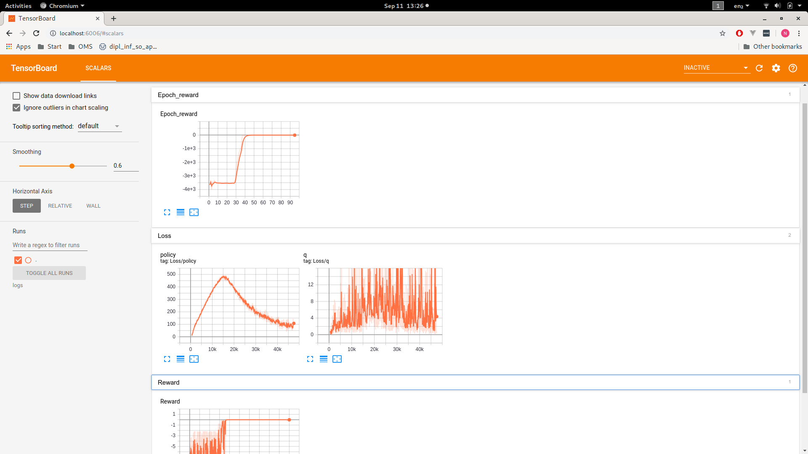

# Doing RL things!

# Logbook

### Lapland
I understood why the heck I am doing all this - for wizard level PhD degree at some point in my life. :)

### **09/10** 
I have added tensorboard summaries in different forms and flavour and got confused by what I saw: The first epoch, a lot of Episodes happened, which went only 8-11 steps, not until 1k steps. Reading in the paper and on [this one](https://towardsdatascience.com/deep-deterministic-policy-gradients-explained-2d94655a9b7b) I found that an update should happen every timestep though, with a couple of randomly sampled minibatches, not every 1000 steps. Also I understood the concept of the target network - it's pretty crazy, you mix in the target network at pretty unexpected points. Also the update mechanic of L = MSE( r(i) + Q'(i+1) - Q(i) ) is weird, I would have expected MSE( r(i) + Q(i+1) - Q(i) ). I have no clue why they did it like that, maybe other than experimenting until break of dawn :D gamma there is the discounting factor

Also I just understood why the process needs to be a Markov Process - because otherwise the replay buffer would not make sense! But because we view the problem as a Markov process, we can sample randomly from a replay buffer, without needing to look at sequential dependencies.

Another question to the article, it looks like the network the guy builds only contains 3 layers, one input, one hidden and one output layer for each net. Is that really all of it? I am just confused, as I thought stuff needs 30 something layers?

The policy gradient basic idea is nicely described [here](https://medium.com/@thechrisyoon/deriving-policy-gradients-and-implementing-reinforce-f887949bd63), though I found that most of the derivation didn't actually end up in the code, but was automatically done by pytorch. Also, policy gradients works on discrete actions and outputs probabilities for each action, which is why so many 'P's ended up in the formulas. It's generally advisable to stay clear of too many Ps.

Policy updating seems a bit weird - the formula has a lot of gradients and is notated weirdly - Q(s, a) instead of Q(s, u(s)). Also I don't really understand how to derive on the value function. The code however makes a lot more sense. The Q-function (critic) gives the expected returns for all the actions until infinity, so taking the negative of them means the lower the expected reward, the higher the loss, and that for me is somehow a good loss to backpropagate with. Pytorch does some magic with the optimizer to not also update the weights of the critic network. I guess if you ran both the critic and the actor optimizer, both nets would be updated.

Next Steps - Taking the pytorch code and using this for pendulum, then for qblade

### **09/11**
I started my day with trying to adapt the DDPG implementation of [this one](https://towardsdatascience.com/deep-deterministic-policy-gradients-explained-2d94655a9b7b) - there were some flaws in the repo such as: death conditions are not regarded at all. The main loop wasn't in the repo at all, no tensorboard reporting, etc

After a bit of tests, it works! It takes 25-ish episodes until convergence - it would be interesting to play around a bit with the hyperparameters...

I played around a bit with hyperparameters...

* changing noise: Seems to be important. With the correlated noise from the article it doesn't converge, with high (.4 and higher) np.uniform noise it does, after 25k steps. .5 after 15k, .6 after 12k but unstable, .7 too much
* changing batch size: not really much of a difference, worse with lower and a bit better with 64 as batchsize
* changing learning rate: higher - more interesting policy loss, but no convergence (until 35k)

As noise seemed that important, I am thinking about introducing parameter noise to the policy... I think that's a nice todo for tomorrow. Also getting the qbladeadapter running would be good :)

### **09/12**

I read a bit about TD3, I recognize the problem of the noisy Q-estimates (Q loss looks quite noisy in tensorboard). Also the algorithm doesn't seem much more complex than ddpg, I could try to implement it aswell.

QBlade keeps crashing a lot. Loading the library works, but already createInstance crashes sometimes. It seems to make a difference whether calling it via \_Z14createInstancev or via the link, but then not deterministically. Something seems badly wrong. It deterministically segfaults at setControlVars or initializeSimulation

WTF-Moment of the day: Suddenly ddpg converges reliably after 7-8 episodes without any noise at all, what I changed is nothing (except for adding parameter noise), but even after disabling it again it still converges quickly. WTF.

DDPG conclusion

* Added random exploration phase of 5k steps, super helpful.
* Changed the OUNoise from the paper to normal uniform noise, kinda helpful (maybe it had been enough to understand OUNoise and tweak it but meh)
* Added parameter noise to the policy, I think it's helpful, currently testing
* With enough noise it seems to produce quite robust results
* Sometimes, in the testing, though the policy has converged, it doesn't do sensful things. That could be due to it once making the hop up 'randomly' and then forgetting it
* I think it would be cool to experiment with TD3...

### **09/18**

I have spent the last couple days working on getting qblade running, but it's a quite iterative process of me trying something and qblade crashing, then me sending a mail to david and him fixing something.

Also somehow, DDPG has stopped converging with the very same hparams as before. I am back to playing around with it.

### **09/23**

I got qblade running and also have access to a small desktop computer where I can run my simulations much quicker. I have done several runs with the default scenario and ddpg, converging most of the time to setting all actions to 1. Q and policy loss approach 0 pretty quickly and for some reason all actions are the same (i.e. same outputs for all 5 control inputs). I have tried several runs, that was the same result every time - and the power output indeed raised. However, I have tried to maximize rotational speed, and it again converges with all actions to 1, not really delivering high rotational speeds. Same with me trying to optimize for high blade bending, the reward reduces over time as noise reduces, and the policy does not learn that shaking the blades could produce high plane bending. Even squaring the reward (in theory intensifying it) doesn't solve that, still converging to always 1 as output.

### **10/06**

Preparing the presentation for tomorrow, I tex-ed some formulas
Bellman
Q(s, a) &= r + \max_{a'}Q(s', a')
Q(s,a) = \mathbb{E}_{s' \sim \varepsilon}(r + \gamma \max_{a'}Q(s', a')|s,a)

Lookup-table
Q_{i+1}(s,a) \leftarrow (1-\alpha)Q_{i}(s,a) + \alpha(target)
target &= r + \gamma \max_{a'}Q_{i}(s', a')

DQN
L(\theta_i)=\mathbb{E}[(target -Q(s,a;\theta_i))^2]
target = r + \gamma \max_{a'} Q(s',a';\theta_{i-1})

DDPG
Q(s,a) = \mathbb{E}[r + \gamma Q(s', \mu(s))|s,a]

target = r + \gamma Q(s', \mu(s);\theta^Q_{i-1})
L(\theta^Q_i)=\mathbb{E}[(target -Q(s,a;\theta^Q_i))^2]
\Delta_{\theta^{\mu}} J(\theta^{\mu}) = \Delta_{\mu}Q(s, \mu(s))\Delta_{\theta^{\mu}}\mu(s)

### **10/07**

Todo-collection
* Setting a higher Gamma-value, as 0.99 is ca 0.37 after 100 iterations already
* Reworking the reward as rpm\*torque
* Trying way smaller fully connected networks
* Only having torque as control parameter, not blade pitch at all
* Having a look at the destruction problem (it should be maximizing at least a little)

Trying with smaller networks: critic [128, 64, 32] and actor [128, 32], increased gamma .9999 and reward as rpm\*torque

Actually trying various hyperparameters all yielded the same results, until I noticed that policy params aren't updating for some reason. Indifferently from learning rate, plain nothing happens. I compared the code with other implementations online (TODO: Add norms to the layers, should be better somehow), but their implementations were mostly equal.

### **10/08**

A talk with Matt hinted me at not having normalized anything. I will implement a normalization at the end of the random exploration phase to bring everything into the same order of magnitude.

So, after a while of trying, I noticed that I was actually dealing with the vanishing gradients problem. On the way there, I tried normalization without noticing that I actually made it far worse because I forgot the ^-1 to the normalizations and thus ended up making the big values way bigger and the small ones way smaller. Because I didn't notice, I tried fighting the vanishing gradients problem by reducing the complexity of the function approximators even further, ending up with both Q and policy as 1-layer network. I think I might want to increase that in the future...

Tries
* Subtract tip deflection from reward
* OU-Noise
* Reparameterize control so actions are gradients

Kill-count: ca 20

### **10/09**

Today I spent the whole day refactoring my code, as I didn't like the way I hacked in noise and normalizations. Now I can easily switch around between different types of noise, the whole code looks way better and it is easier to adjust things.

### **10/15**

I managed to get my code running again, as I was getting NaNs after division by zero in the normalization. Now I am having the problem that the turbine spools up to ca 2rad, then stays at 0.4rad forever. Also, usually one of the blades ends up bended a lot more than the others, never returning to straight. My next tries are using action gradients instead of directly inputting the action space, as I can limit the movement per step like that. Will be completely new hparam tuning then. I am thinking about automatizing hparam tuning, as it gets a bit annoying to do it per hand.

Kill-count: ca 15

I implemented gradient actions. I found that usually during random exploration, the first blades break off. 

### **10/16**

We were having zero parameters again after random exploration - problem was that I normalized after random exploration but did some learning before already
Changing the orders of magnitude the network was getting after normalizing again resulted in zeroing out all weights and stopping learning

Later we had other normalization problems where the turbine shaking like crazy later but not doing so in random exploration resulted in the same problem as before - with q exploding.

Then, it wasn't even able to converge to setting the action to a certain value. I removed gradient actions which somehow seemed to improve on that. However, it is still not able to converge the bistable windturbine.

The turbine appears to be stable either in backwards rotation super-high speed (high torque makes the rotor rotate backwards) or forwards super-high speed (4 rads, where 1 should be normal). In the latter case, sometimes blades fall off. The actions bounce between minimum and maximum, which is why we suspect a too high learning rate to cause overfitting. Because I can, I also try running a more complex network.

Overnight I ran 4 simulations

One with lr 1e-4 (second from top)
One with lr 1e-5 (third from top)
One with the complex networks (fifth from top)
One with complex networks and higher gamma/tau (sixth from top)
One who should hold a specific rotational speed (seventh)

### **10/17**

Unfortunately I can't really look at my simulations at the moment, because the server seems to be unavailable. However I fixed checkpoint writing and a bug of a duplicate reset at startup.

### **10/18**

The machine is still not available, so we resort to some theoretical things.

An idea would be to rework the reward function a bit. Ideas are
* Include rated rotational speed to punish exceeding it (0.1\*(x-0.6)^6)
* Smoothing it with a running filter (averaging across the last 10 steps or so)

* Using experiences from other trainings for normalization instead of misusing random exploration for this
* Clipping rewards/losses as there have been some outliers

Also we found that Openai gyms sometimes provide time derivative informations, which we could do too. We would only need to get rid of some noise there, as a single-step derivative will most likely be very noisy. We should do some signal processing there...

Colleague said just concatenating the last k states to the current state would be enough for adding temporal difference information, as the net can do the subtraction itself. Maybe 

Also we did some paper reading, the zico paper tries a REINFORCE algorithm which is basically policy gradients with a stochastic policy and an algorithm they present themselves (TRPS) but which is amazingly close to TRPO

### **11/01**

I have tried a couple of things, which didn't work at first due to broken normalizations and then due to whyever. I changed the death condition of the turbine to a high rotation speed, which makes it impossible for the simulation to stay in unnatural space for too long. This didn't help though. However it exposes a bit of a different behaviour - instead of going full nut mode, it stays pretty stable at a negative rotational speed.

Furthermore, I started implementing prioritized experience replay, the replay buffer already works. However (because of floating point instability) I can't normalize my priorities to a probability distribution without a hassle :/ I'll implement a sumtree

Also I believe that I should refactor again, the code has gotten too complex and unreadable for all the hparam settings. Maybe I can take some settings out (type of noise?) and split the ddpg class into two, a wrapper which does all the normalization, past feeding etc and an actual ddpg class.

I started experimenting with feeding past observations, it didn't work for a while but I fixed it. Now it is having heavy loss explosions, though normalization works okay. I will try to leave it running a bit. It could be division by almost zero somewhere... It also stays below zero rpm, but way more noisy than the variant without past feeding

### **11/04**

Vanishing gradients, here we go again. I should reduce complexity? Mäh.

### **11/06**

I tracked down the vanishing gradients as well as the loss explosions to past feeding. This seems to introduce serious instability for some reason. Sending in only one observation stabilized everything. Also PER seems to do fine. It now converges to slowly rotating the turbine backwards, actually reacting on changes in a way...

Okay I implemented a P-Controller instead of random exploration - I am actually shit at machine learning. With just a simple linear controller I can easily stabilize rotational speed at a fixed rpm...

### **11/08**

It was pure luck hitting the one working version. I couldn't reproduce even with the same hyperparameters again. Now I decided to just let automated hyperparameter search run and search for a good version while I write my paper. It can run over the weekend or so.

I had several cases of vanishing actor gradients and for some reason increasing the batch size made it better. So though a higher batch-size should reduce the variance of the samples, I got higher gradients. A possible explanation would be that the high noise in the low batch sizes sent my network flying off somewhere, and my relu activation being far left. I tried to plot my activations (for the first layer) and they were for some reason all the same value, 0.174. I don't know how that could even happen. By randon weight initialization, they should really not be all the same, with a few exceptions being higher than that.

However, I am off writing down the things now while waiting for some automatized hparam searching. I let the thing run 2k episodes and then test for 50k steps, gathering the total returns and deaths in the testing phase. It's also still writing logs while doing so.

New observation: Training is really stable until ca 30k steps after the first time maniac-forwards mode. Then, q loss explodes and things go badly. Also, I had another run which looked kinda good over big spans of time. Again the q loss explosion. I switched to huber loss now.

### **11/25**

I have read some papers around batch normalization, understanding that it achieves between-layer normalization and thus allows for higher learning rates. It adds some more parameters to learn in turn.
BN works pretty well, on my laptop I could use a LR of 1e-3 and it still worked. Also better with the complex networks

Also it would be helpful to restrict actions in the ddpg module to store the real actions in the replay buffer. I have tried it but it seems to have a bug still.

TODOs paper:
- Abstract (3h)
- RL/env: add formulae (1h)
- RL/Q learning (4h)
- RL/PG (8h)
- RL/DDPG (6h)
- Exp/Exploration/Action noise: Add formulae and reasoning (2h)
- Exp/Exploration/Random exploration: Add formulae, more detail (2h)
- Exp/Exploration/Parameter noise: More detail (1h)
- Exp/VanGrad/Simple architecture: More detail, cross reference to complexities from other papers (1h)
- Exp/VanGrad/Norm: Cross-references to other norm papers (30m)
- Exp/ActGrad/GradAct: Add formulae, more detail (1.5h)
- Exp/ActGrad/FeedPast: Add formulae (1h)
- Exp/ActGrad/Clip: Add formulae (1h)
- Exp/Nonsense/PER: Write (4h)
- Exp/Nonsense/Data aug: Add details (30m)
- Exp/QLoss/Huber: Much more math (2h)
- Exp/QLoss/Twin: Much more explanation (4h)
- Exp/QLoss/BN: Much more expl (3h)
- Eval/First: Describe hparams, describe results (15h)
- Eval/Second: Describe hparams, results (4h)
- Eval/Comparison: Compare (5h)
- Future: Write (8h)
- Concl: Write (15h)

### Kritik paper

nicht so sehr Tagebuch-style, die aktuelle Experimentations-Sektion komplett einstampfen. Ah doch nicht.

Mehr Bilder

